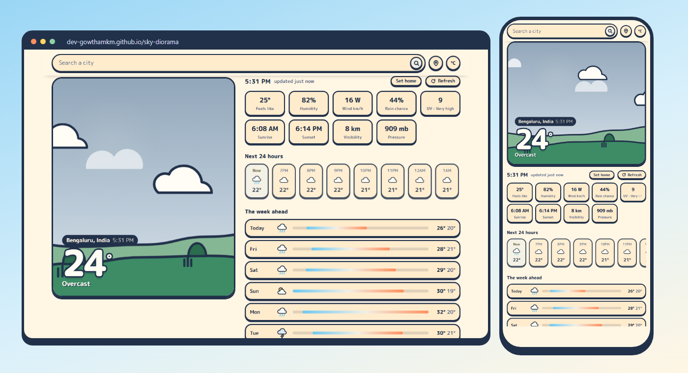

# Sky Diorama

**Made by [Gowtham KM](https://github.com/Dev-GowthamKM).**

A weather app where the forecast is a scene you watch rather than a dashboard you read.
Search any city in the world and the sky, hills, light and weather redraw themselves —
a sun that blinks at you, drifting clouds, rain that puddles, fog on the hillside,
lightning, birds, and an aircraft crossing now and then.

**Live:** https://Dev-GowthamKM.github.io/sky-diorama/

[](https://dev-gowthamkm.github.io/sky-diorama/)


## What it does

- **Worldwide search** — any city or town, with suggestions as you type
- **Current location** — uses GPS where the browser allows it, with a saved home place as a fallback
- **Live readings** — temperature, RealFeel, humidity, wind and gusts, UV, visibility, pressure, dew point
- **Local timing** — the clock, sunrise, sunset and hourly labels all follow the place you're viewing, not your own timezone
- **24-hour and 7-day outlook** with temperature-range bars
- **°C / °F** toggle, remembered between visits
- **Recently viewed places** — tap the empty search box to jump between cities

## Interactions

| Do this | And this happens |
|---|---|
| Tap a cloud | The sky advances: sunny → fog → cloudy → rain → thunder → snow → clear |
| Tap the sun or moon | It hops, and says something |
| Move the pointer, or tilt a phone | The scene parallaxes |
| "Change the sky" buttons | Preview any condition |
| "Show the real sky" | Back to the actual forecast |

Cloud tapping changes the picture only. The readings always stay real.

## Running it

It is one self-contained HTML file. No build step, no dependencies, no API key.

```bash
git clone https://github.com/Dev-GowthamKM/sky-diorama.git
cd sky-diorama
python3 -m http.server 8000
```

Then open <http://localhost:8000>.

**Serve it over `http://localhost` or `https://`, not by double-clicking the file.**
Browsers refuse the Geolocation API on `file://` origins, and Safari also blocks
local storage there, so the location button and saved places won't work.

### Publishing with GitHub Pages

Settings → Pages → Source: *Deploy from a branch* → `main` / `root`. Your site
appears at `https://Dev-GowthamKM.github.io/sky-diorama/` within a minute or two.
Pages serves over HTTPS, so geolocation works there.

## Data

Weather comes from [Open-Meteo](https://open-meteo.com), free for non-commercial use
and requiring no API key. Geocoding for the search box uses the Open-Meteo geocoding API.
Weather data by Open-Meteo.com, licensed CC BY 4.0.

To swap in a different provider, replace `omURL()` and `shapeOM()` near the bottom of
`index.html`. Everything upstream of those two functions is provider-agnostic.

## Built with

Plain HTML, CSS and JavaScript. No framework, no bundler.

- The scene is inline SVG on a canvas that re-measures itself, so hills, scenery and
  precipitation are generated to fit whatever aspect ratio the frame ends up at
- Container queries size the temperature and labels against the scene, not the viewport
- Respects `prefers-reduced-motion` and `prefers-color-scheme`
- Typeface: M PLUS Rounded 1c

## Browser support

Current Chrome, Safari, Firefox and Edge. Uses container queries, `ResizeObserver`
and the Web Animations API.

## Author

Created by **Gowtham KM** — [github.com/Dev-GowthamKM](https://github.com/Dev-GowthamKM).

If you use, copy or fork this project, please credit Gowtham KM and link back to
this repository.

## Licence

MIT © 2026 Gowtham KM — see [LICENSE](LICENSE). You're free to use and modify it,
but the copyright notice and licence must be kept in every copy.
